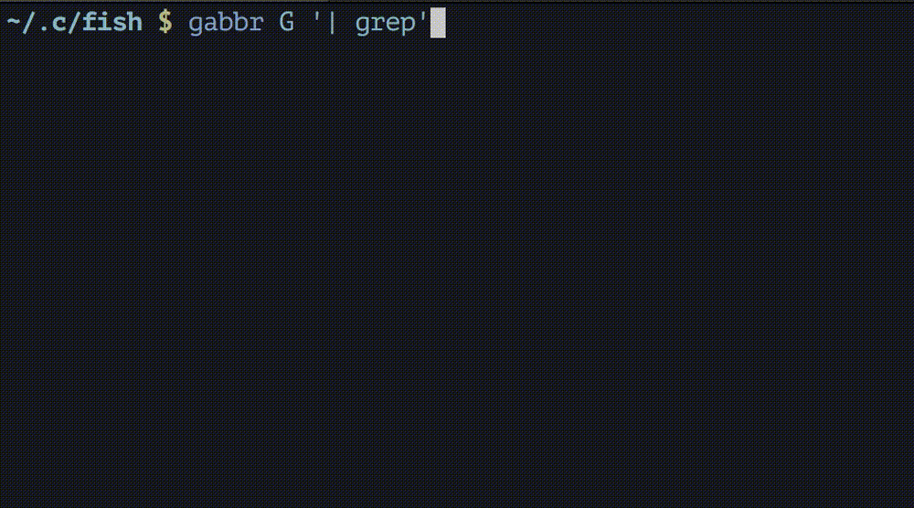

# fish-global-abbreviation

[![Slack Room][slack-badge]][slack-link]

Global abbreviation for fish shell



## Install

With [fisherman]

```
fisher ryotako/fish-global-abbreviation
```

## Usage

```fish
# add abbreviation
gabbr G '| grep'
gabbr (-a|--add) G '| grep'

# show abbreviation
gabbr
gabbr (-s|--show)

# list abbreviation names
gabbr (-l|--list)

# erase abbreviation
gabbr (-e|--erase)

# reload abbreviations
gabbr (-r|--reload)

# add function-abbreviation
# Function-abbreviations are evaluated when they are expanded.
gabbr (-f|--function) D 'date +%Y/%m/%d'
```

## Setup

### `gabbr_config`

**optional**

`$gabbr_config` is the file path for saving global abbreviation configurations.
If `$gabbr_config` variable exists, `gabbr` output configurations to `$gabbr_config`.
You can keep all abbreviations under git control by committing that file.

[slack-link]: https://fisherman-wharf.herokuapp.com
[slack-badge]: https://fisherman-wharf.herokuapp.com/badge.svg
[fisherman]: https://github.com/fisherman/fisherman
